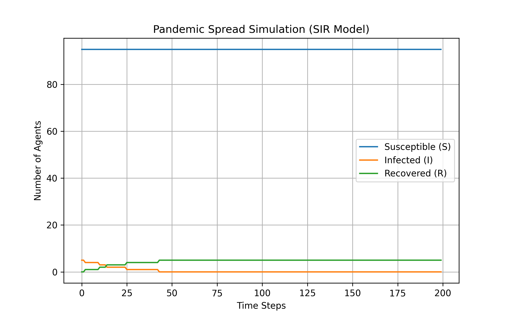
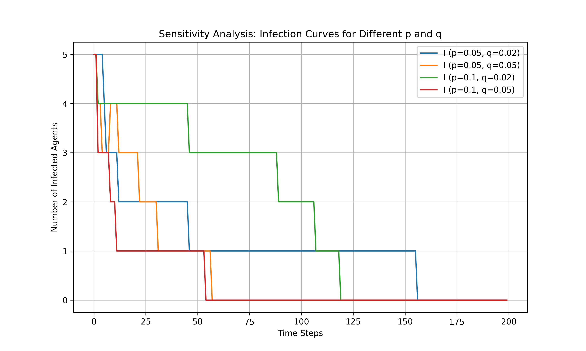
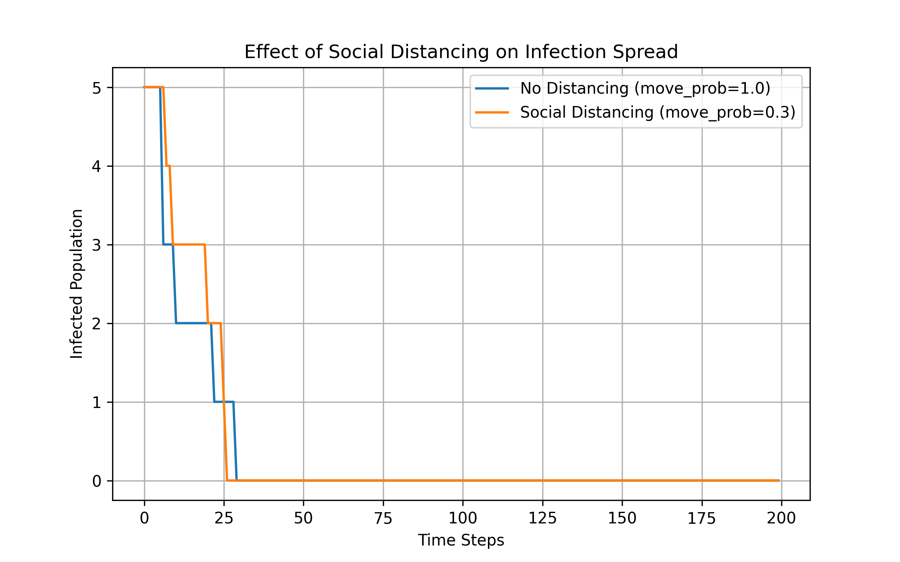
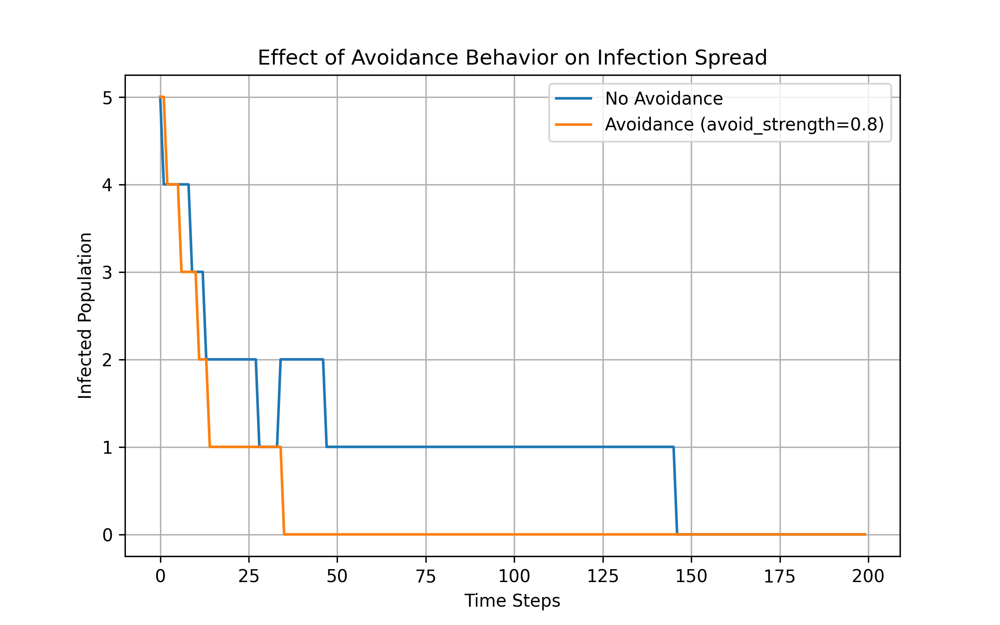

## BMI500 Fall 2025 HW11
## Juyoung LEE (juyoung.lee@emory.edu)
## Agent-Based Modeling of Pandemic Spread (Homework 2)

## 1. Summary

This project implements a pandemic spread simulation using an **Agent-Based Model (ABM)** on a **75×75 grid**.  

Each of the 100 agents can be:
- **S = Susceptible**
- **I = Infected**
- **R = Recovered (immune)**

The model explores:
1. Infection dynamics  
2. Sensitivity to infection rate `p` and recovery rate `q`  
3. Social distancing using reduced movement (`move_prob`)  
4. Avoidance of infected agents (`avoid_strength`)

### Simulation Results

#### Base SIR Model
  
*Figure 1. Pandemic spread simulation under the baseline SIR model (p=0.05, q=0.05).*

#### Sensitivity Analysis
  
*Figure 2. Sensitivity analysis for different infection (p) and recovery (q) probabilities.*

#### Social Distancing Intervention
  
*Figure 3. Comparing infection dynamics with and without social distancing (move_prob=0.3).*

#### Avoidance Behavior
  
*Figure 4. Avoidance behavior (avoid_strength=0.8) further limits infection spread by spatially separating susceptible and infected agents.*

## 2. Key insights
- Infection spread follows the expected SIR dynamics: rapid infection growth, peak, then decline as recoveries rise.
- Increasing the infection probability (p) accelerates and amplifies outbreaks, while increasing the recovery probability (q) shortens and softens them.
- Social distancing (lower move_prob) and avoidance (avoid_strength) both flatten the infection curve - reducing peak infections and delaying the outbreak’s maximum.
- Strong interventions lead to slower but more stable epidemic control, demonstrating clear “flatten-the-curve” behavior.

## 3. Comparative model performance
| Scenario                              | Infection Peak     | Time to Peak   | Recovery Rate Trend | Observation             |
| ------------------------------------- | ------------------ | -------------- | ------------------- | ----------------------- |
| **Baseline (p=0.10, q=0.05)**         | High               | Early          | Moderate            | Standard fast outbreak  |
| **Lower p (0.05, q=0.05)**            | Low                | Later          | Smooth              | Slower infection spread |
| **Slower q (0.10, q=0.02)**           | Very High          | Slightly Later | Delayed             | Long infectious period  |
| **Social Distancing (move_prob=0.3)** | Strongly Reduced   | Delayed        | Stable              | Curve flattened         |
| **Avoidance (avoid_strength=0.8)**    | Moderately Reduced | Delayed        | Gradual             | Reduced spatial spread  |

Summary:
Distancing primarily limits contacts, while avoidance changes spatial mixing. When combined, they minimize the infection peak and extend the outbreak duration, helping prevent healthcare system overload.

## 4. Relevance to model-based machine learning
- The agent-based model provides a mechanistic framework that can be integrated with model-based ML for data-driven parameter estimation and policy optimization.
- ML models could learn or adapt parameters like p, q, and move_prob from real-world data.
- Reinforcement learning could identify optimal, adaptive intervention strategies (e.g., dynamic distancing intensity).
- This approach combines interpretable rule-based dynamics with adaptive learning, aligning with the goals of model-based ML.

## 5. Suggestions for future modeling improvements
- Introduce agent heterogeneity (e.g., age, compliance, health condition).
- Add spatial clustering to simulate real communities or households.
- Include vaccination, reinfection, or mortality dynamics.
- Combine ABM with reinforcement learning to find optimal control strategies automatically.
- Develop richer visualizations such as heatmaps or animated grid evolution to analyze spatial spread patterns.

**Disclaimer:** ChatGPT (OpenAI GPT-5) was used to assist in designing the overall structure and logical flow of the simulation code. The AI provided high-level pseudocode and modular organization (e.g., agent definitions, infection–recovery loop, and extension points for social distancing and avoidance). 
The author manually implemented, tuned, validated, and commented on all final codes after fully understanding the model logic and ensuring the correctness of simulation outputs.
